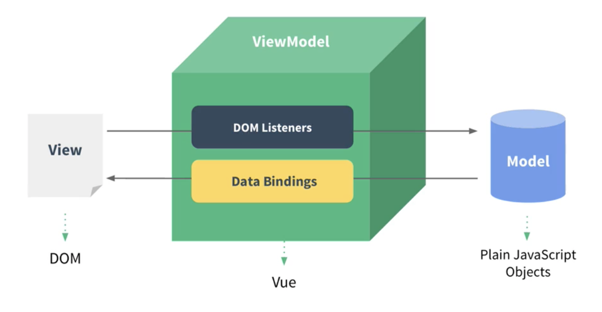

이번엔 인프런이라는 교육 사이트 중 [(장기효)캡틴판교님](https://joshua1988.github.io/)의 [Vue.js 시작하기 - Age of Vue.js](https://www.inflearn.com/course/age-of-vuejs/dashboard) 를 듣고 메모한 내용을 포스팅 해봅니다.

현재 Back-End 개발 업무를 맡고 있어, Vue 소스를 직접 개발할 일은 많지 않지만, 팀태 Front-End 개발 파트가 같이 존재하고, Vue 소스를 볼 수 있는 권한이 있어 공부를 해둬서 나쁠게 없을 것 같다는 생각에 공부를 하게 되었습니다.

읽기 좋게 풀어쓴 글이 아니라 단순히 메모를 옮겨 두워 핵심 키워드 정도만 파악할 수 있는 점 참고 부탁드립니다.

<!--more-->

### 개발환경 세팅
프로그램 설치 : 크롬, visual studio, node.js, vue.js dev tools(크롬 플러그인)  
VS Code 플러그인 설치 : vetur, Live Server
> 저는 VS Code 대신 intelliJ 를 사용하여 강의 실습을 진행하였으나, 큰 불편함을 느끼지 못했습니다.

### Vue는 무엇인가?
> MVVM 패턴의 뷰모델(View Model) 레이어에 해당하는 화면단 라이브러리


**reactivity** : data의 변화를 library에서 감지해서 화면에 바로 반영  
> vue 의 data 속성에 반영되어 있다.

### 뷰 인스턴스
- new Vue(); 로 생성, 생성자 함수를 이용하여 기존 정의된 method 등을 사용, Root 컴포넌트가 된다.
- 특정 tag에 element 지정 필수
- 인스턴스 속성
  - el : 인스턴스가 그려지는 화면의 시작점 (특정 HTML Tag)
  - template : 화면에 표시할 요소 (HTML, CSS 등)
  - data : 뷰의 반응성(Reactivity)가 반영된 데이터 속성
  - methods : 화면의 동작과 이벤트 로직을 제어하는 메서드
  - created : 뷰의 라이프 사이클과 관련된 속성
  - watch : data에서 정의한 속성이 변화 했을때 추가 동작을 수행할 수 있게 정의하는 속성

### 뷰 컴포넌트 
화면의 영역을 구분하여 개발
> 재사용성이 올라가고 빠르게 화면 제작이 가능
- 전역 컴포넌트 : vue.component 사용, Plug-in or library 형태 사용
- 지역 컴포넌트 : Vue 생성자, 인스턴스 속성 components 사용

### 컴포넌트 통신방식
> 뷰 컴포넌트는 각각 고유한 데이터 유효 범위를 갖는다.


- props 전달  

```HTML
<컴포넌트 v-bind:props 속성 이름 = "상위 컴포넌트의 data 이름 "></컴포넌트>
```
```javascript
ex> components: {
    '컴포넌트 명': {
        ...
        props: ['props 명']
        ...
  }
}
```

- event 발행   

```HTML
<컴포넌트 v-on:하위 컴포넌트에서 발생한 event 이름 = "상위 컴포넌트의 method 이름 "></컴포넌트>
```
```javascript
ex> components: {
    '컴포넌트 명': {
        ...
        methods: {
            method name: function () {
            this.$emit('event name');
          }
        }
        ...
  }
}
```
> event 명에는 camel case 사용이 불가하다.

### 같은 레벨간 컴포넌트의 통신 방법
같은 레벨간 `직접 통신은 불가`하여 아래 그림과 같이 통신

### 뷰 라우터
뷰 라이브러리를 이용하여 `싱글 페이지 애플리케이션을 구현`할 때 사용
라우터 인스턴스를 만들어 뷰 인스턴스에 등록한다.
- 옵션
  - routes : 라우팅 한 URL과 컴포넌트 값 지정 
    - router 당 component 는 1개만 가능
  - mode : url 해쉬값 제거 속성 (history - # 삭제)
- router-view : component 가 뿌려지는 영역
- router-link : a tag 로 화면에 표출 (링크 이동)

### Axios 
뷰에서 권고하는 HTTP 통신 라이브러리
> Promise (javascript비동기 처리 패턴) 기반 HTTP 라이브러리

### Template
- 데이터 바인딩 : 뷰 인스턴스에서 정의한 속성들을 화면에 표시하는 방법
  - mustache tag 
- 디렉티브 : 뷰로 화면의 요소를 더 쉽게 조작하기 위한 문법
  - v-if, v-for, v-bind, v-on, v-model 등
- computed : data 속성이 변했을때 이를 감지하고 `자동으로 다시 연산`
  - 템플릿 코드의 가동석을 위한 기능, 간단한 data 연산 작업에 적합
  - 반응형 getter, 계산 결과가 캐싱된다.
- watch : 특정 데티어의 변화를 감지하여 `자동으로 특정 로직을 수행` 해주는 속성

### Vue CLI
뷰로 빠르게 프로젝트를 구성하고 프로토 타이핑을 하고 싶을때 사용하는 CLI 도구
- 설치 
```shell
npm install -g @vue/cli
```
- 프로젝트 생성 
```shell
vue create {프로젝트 명}
```

### 싱글 파일 컴포넌트
> 화면의 특정 여역에 대한 HTML, CSS, JS 코드를 한 파일에서 관리하는 방법  

vue 확장자를 가진 모든 파일

### 마무리

요즘 프런트 진영의 변화가 빠르고 크다고 들었는데, 이렇게 강의를 통해서 기초 지식을 배워 보니 예전 방식과 많이 다르고 새로운게 많았던것 같습니다.

그럼 이만. 🥕👋🏼🖐🏼

### 참고자료
[https://joshua1988.github.io/vue-camp](https://joshua1988.github.io/vue-camp)